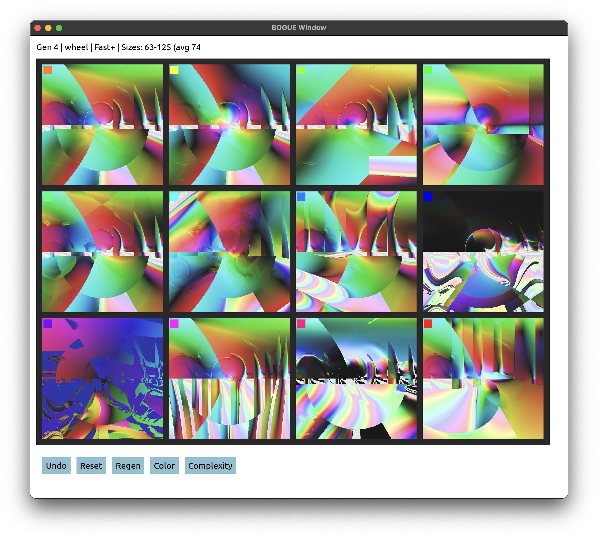
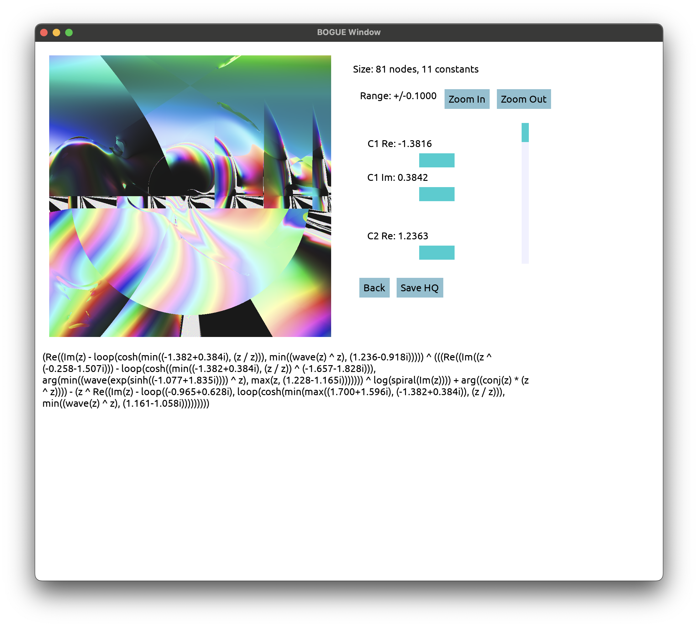

# Pic Breeder Imaginary

An evolutionary art tool that breeds complex number expressions as images. Inspired by [Picbreeder](http://picbreeder.org/).

Each image is generated by evaluating a mathematical expression over the complex plane, where each pixel coordinate `z = x + yi` is transformed through the expression, and the result is mapped to a color.

## Screenshots

| Main Selection Grid                                   | Edit Mode                                             |
|:-----------------------------------------------------:|:-----------------------------------------------------:|
|  |  |

## Examples

| Generation 25                       | Generation 20                       |
|:-----------------------------------:|:-----------------------------------:|
|  |  |

## Features

- **Complex Expression Evolution**: Expressions include arithmetic (`+`, `-`, `*`, `/`, `^`), transcendental functions (`sin`, `cos`, `exp`, `log`, `sinh`, `cosh`, `tanh`, `sqrt`), and special operations (`conj`, `|z|`, `arg`, `Re`, `Im`, `max`, `min`)
- **Custom Transforms**: `spiral` and `wave` functions for artistic patterns
- **Loop Operation**: A higher-order `loop(n, body)` that iterates `body` expression with continuous interpolation, creating fractal-like self-similar structures
- **Multiple Color Modes**: wheel, coords, vibrant, rainbow, fire, ice, twilight
- **Complexity Control**: Choose mutation bias (Decrease, Maintain, Slow+, Fast+) to guide expression growth
- **Hybridization**: Expressions you explore in edit mode are saved to a "trophy list" and can be combined with new expressions during evolution
- **Interactive Evolution**: Select your favorite from 12 variants to breed the next generation
- **Edit Mode**: Fine-tune constants in expressions using sliders with adjustable precision
- **Undo Support**: Go back to previous generations to explore different evolutionary paths
- **High-Quality Export**: Save individual images at 800x800 resolution

## Building

Requires OCaml 4.14+, Dune, and SDL2.

```bash
# Install dependencies
opam install dune bogue tsdl

# Build
dune build

# Run
dune exec pic_breeder
```

## Usage

### Main Window

The main window displays a 4x3 grid of expression variants. Each cell shows a rendered image with a colored number indicator in the top-left corner.

**Controls:**

- **Click** on any image to select it as the parent for the next generation
- **Ctrl+Click** to enter edit mode for fine-tuning
- **Undo** - Revert to the previous generation
- **Reset** - Start fresh with new random expressions
- **Regen** - Generate new mutations from the current parent
- **Color** - Cycle through color modes (wheel, coords, vibrant, rainbow, fire, ice, twilight)
- **Complexity** - Cycle mutation bias (Decrease, Maintain, Slow+, Fast+)
- **Trophies** - View and manage the trophy list (click to remove)
- **Ctrl+Z** - Keyboard shortcut for undo
- **Escape** - Quit

The status bar shows the current generation number, color mode, complexity mode, and expression size statistics (min-max and average node count).

### Edit Mode

Edit mode allows fine-tuning of an expression's constants using sliders. Each constant has separate sliders for its real and imaginary parts.

**Controls:**

- **Sliders** - Adjust constant values in real-time
- **Zoom In/Out** - Halve or double the slider range for finer or coarser control
- **Save HQ** - Export the image at 800x800 resolution
- **Back** - Return to the main grid

The expression text is displayed at the bottom, and the size info shows node count and number of constants.

**Note:** Entering edit mode adds the expression to the "trophy list" for hybridization - these expressions may be combined with future mutations.

### Output

Images are saved to the `output/` directory as PPM files. You can convert them using ImageMagick:

```bash
convert output/edited_gen_0010_pic_01.ppm output/image.png
```

## How It Works

1. **Expression Generation**: Random expressions are generated as abstract syntax trees combining variables, constants, and operations
2. **Mutation**: Selected expressions undergo mutations including:
   - Wrapping nodes with unary operations
   - Inserting binary operations
   - Replacing subtrees with new random expressions
   - Perturbing constant values
   - Swapping operators
   - Hybridizing with trophy expressions (combining with previously-liked expressions)
3. **Rendering**: Each pixel `(px, py)` is mapped to a complex number `z` in the range `[-2, 2] x [-2, 2]`, the expression is evaluated, and the result is converted to a color
4. **Color Mapping**: The complex result is mapped to color using various schemes (e.g., argument to hue, magnitude to brightness)

## Project Structure

```text
pic-breeder-imaginary/
├── lib/
│   ├── complex_expr.ml   # Complex number AST and evaluation
│   ├── mutation.ml       # Expression mutation and hybridization
│   ├── color.ml          # Complex-to-color mappings
│   ├── render.ml         # Image rendering
│   └── pic_breeder.ml    # Library exports
├── bin/
│   └── main.ml           # GUI application (Bogue/SDL2)
├── examples/             # Sample generated images
└── output/               # Saved high-quality images
```

## License

MIT
