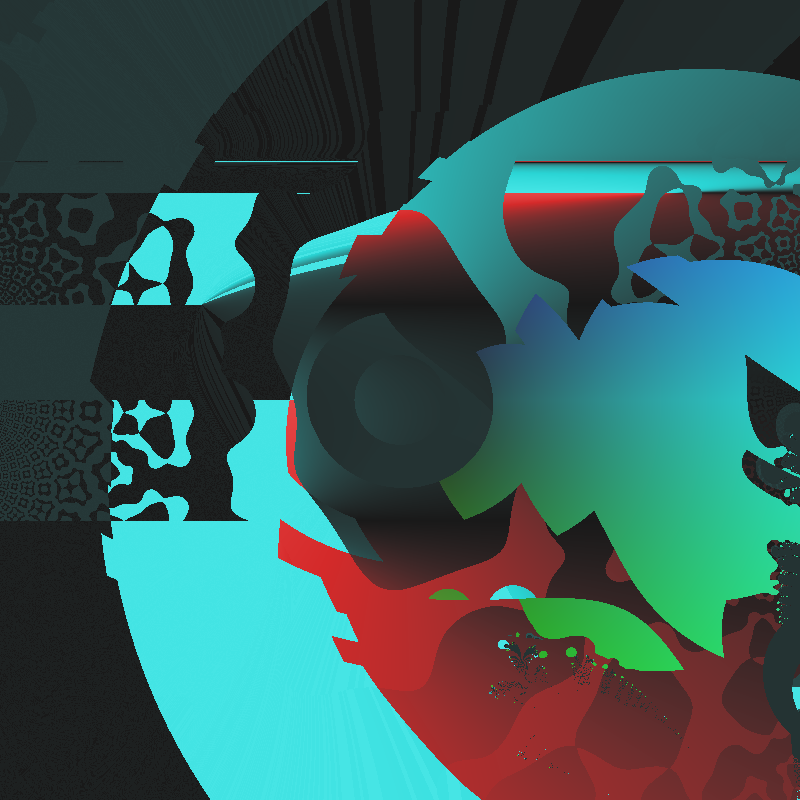
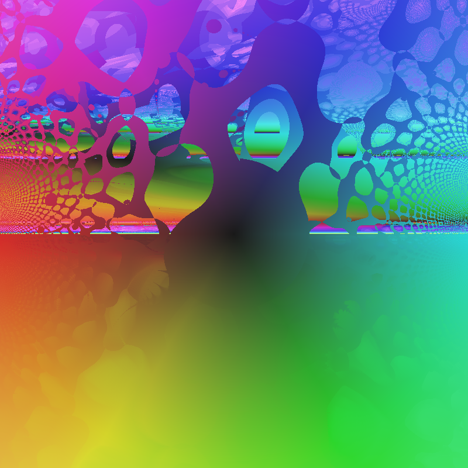

# Pic Breeder Imaginary

An evolutionary art tool that breeds complex number expressions as images. Inspired by [Picbreeder](http://picbreeder.org/).

Each image is generated by evaluating a mathematical expression over the complex plane, where each pixel coordinate `z = x + yi` is transformed through the expression, and the result is mapped to a color.

## Examples

| Generation 25                       | Generation 20                       |
|:-----------------------------------:|:-----------------------------------:|
|  |  |

## Features

- **Complex Expression Evolution**: Expressions include arithmetic (`+`, `-`, `*`, `/`, `^`), transcendental functions (`sin`, `cos`, `exp`, `log`, `sinh`, `cosh`, `tanh`, `sqrt`), and special operations (`conj`, `|z|`, `arg`, `Re`, `Im`)
- **Custom Transforms**: `spiral` and `wave` functions for artistic patterns
- **Loop Operation**: A higher-order `loop(n, body)` that iterates `body` expression `floor(|n|)` times, creating fractal-like self-similar structures
- **Multiple Color Modes**: wheel, coords, vibrant, rainbow, fire, ice, twilight
- **Viewport Panning**: Move the view center to break symmetry or create depth effects
- **Interactive Evolution**: Select your favorite from 12 variants to breed the next generation
- **Undo Support**: Go back to previous generations to explore different evolutionary paths
- **High-Quality Export**: Save individual images at 800x800 resolution

## Building

Requires OCaml 4.14+ and Dune.

```bash
# Install dependencies
opam install dune

# Build
dune build

# Run
dune exec pic_breeder
```

## Usage

```text
=== Pic Breeder Commands ===
  1-12     : Select picture and evolve
  u        : Undo (go back to previous generation)
  s 1-12   : Save high-quality version of picture
  c <mode> : Change color mode (wheel, coords, vibrant, rainbow, fire, ice, twilight)
  v x y    : Set viewport center (e.g., 'v 1 0.5' centers at 1+0.5i)
  v        : Reset viewport to origin (0, 0)
  r        : Reset with new random expressions
  g        : Regenerate grid (same parent, new mutations)
  p        : Print current expressions
  h        : Show this help
  q        : Quit
```

The default domain is `[-2, 2] x [-2, 2]` centered at the origin. Use the viewport command to pan the view - for example, `v 0 -1` places the origin at the top of the image, which can create interesting depth-of-field effects.

Images are saved to the `output/` directory as PPM files. You can view them with most image viewers or convert them using ImageMagick:

```bash
convert output/gen_0010_grid.ppm output/grid.png
```

## How It Works

1. **Expression Generation**: Random expressions are generated as abstract syntax trees combining variables, constants, and operations
2. **Mutation**: Selected expressions undergo mutations including:
   - Wrapping nodes with unary operations
   - Inserting binary operations
   - Replacing subtrees with new random expressions
   - Perturbing constant values
   - Swapping operators
3. **Rendering**: Each pixel `(px, py)` is mapped to a complex number `z` in the range `[-2, 2] x [-2, 2]`, the expression is evaluated, and the result is converted to a color
4. **Color Mapping**: The complex result is mapped to color using various schemes (e.g., argument to hue, magnitude to brightness)

## Project Structure

```text
pic-breeder-imaginary/
├── lib/
│   ├── complex_expr.ml   # Complex number AST and evaluation
│   ├── mutation.ml       # Expression mutation operations
│   ├── color.ml          # Complex-to-color mappings
│   ├── render.ml         # Image rendering
│   └── pic_breeder.ml    # Library exports
├── bin/
│   └── main.ml           # Interactive CLI application
└── examples/             # Sample generated images
```

## License

MIT
